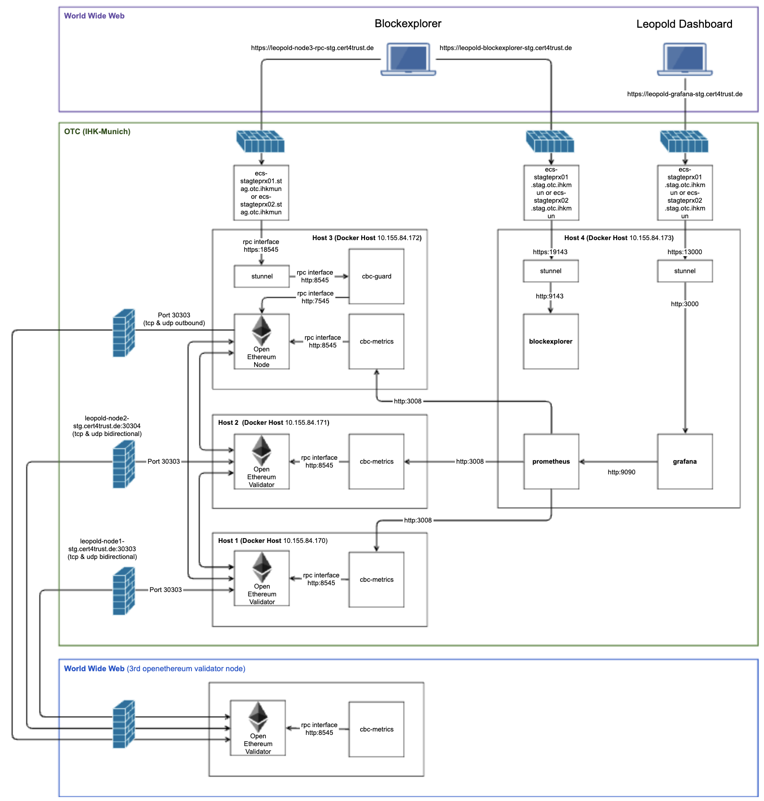
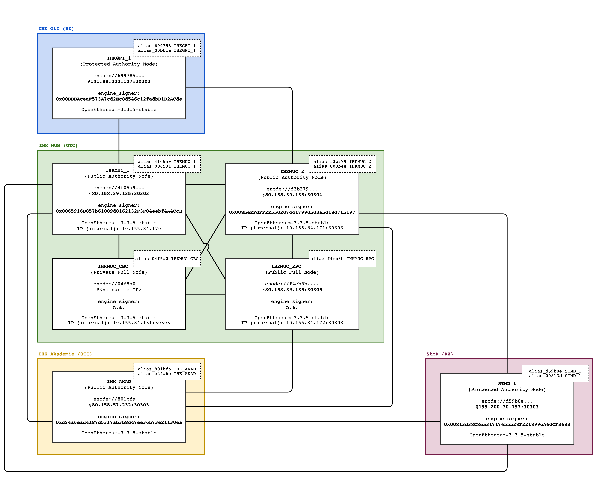

# OpenEthereum Test Client for Leopold Blockchain 

How can I access the Leopold test environment?

## 2. Contact

Please, get in contact with [sprunck@muenchen.ihk.de](mailto:sprunck@muenchen.ihk.de)

## 2. Architecture

The following diagram shows the Leopold staging environment. Within the IHK Munich (green box), there are 
three OpenEthereum nodes that represent the actual blockchain. Two of these nodes are validator nodes, namely 
Host 1 and 2. A third node serves only as an API interface, providing an RPC interface to the outside, namely 
Host 3. All other software components are used for monitoring the Leopold blockchain.

### 2.1 Deployment



### 2.2 Topology




### 3.0 Getting Started

Before testing we have to create target folders and 
configuration on local machine.

#### Install GCC-12 and G++-12 and set environment

```shell
sudo apt install gcc-12 g++-12
export CC=/usr/bin/gcc-12
export CXX=/usr/bin/g++-12
```


#### Build Artefacts (once)

For the generation of secrets we need two applications, i.e. *ethkey* and *ethstore*

```shell
./build-artifacts.sh
```

#### Create Secrets (once)

```shell
echo "1234" > environment/staging/secrets/AccountMnemonic
echo "5678" > environment/staging/secrets/NetworkMnemonic
```

```shell
./setup_folders.sh
```

```shell
./secrets_generation.sh
```

Expected result:

```text
###################################################################################
# 1. Create Secrets and Configuration
###################################################################################
Generating key material for validator node

NETWORK_MNEMONIC -> '5678'
ACCOUNT_MNEMONIC -> '1234'
PRIV_KEY         -> 5bdbac19375a24cac7fea60830773f1c9497012394c7b059efd2c9a3669810fa
ADDR             -> 0x0012a3c9f542a2753a7d46f8b2df7fe5762a548a

Generating password for keystore file for node 
0x0012a3c9f542a2753a7d46f8b2df7fe5762a548a
```

#### Start local Leopold Node

```shell
./test-leopold.sh
```

Expected result:

```text
   Compiling libc v0.2.159
   Compiling proc-macro2 v1.0.87
   Compiling unicode-ident v1.0.13
   Compiling serde v1.0.210
   Compiling byteorder v1.5.0
   .
   .
   Compiling ethcore-service v0.1.0 (/home/parallels/RustroverProjects/openethereum/crates/ethcore/service)
   Compiling parity-rpc-client v1.4.0 (/home/parallels/RustroverProjects/openethereum/crates/util/cli-signer/rpc-client)
   Compiling cli-signer v1.4.0 (/home/parallels/RustroverProjects/openethereum/crates/util/cli-signer)
   Compiling openethereum v3.5.0-rc0 (/home/parallels/RustroverProjects/openethereum)
    Finished `release` profile [optimized] target(s) in 7m 16s
warning: the following packages contain code that will be rejected by a future version of Rust: protobuf v2.16.2
note: to see what the problems were, use the option `--future-incompat-report`, or run `cargo report future-incompatibilities --id 1`
     Running `target/release/openethereum --config /home/parity/authority.toml`
{"@timestamp":"2024-10-23T06:25:48.645Z","@version":"1","SERVICE":"main","level":"INFO","STEP":"openethereum::run","message":"Starting OpenEthereum/v3.5.0-rc0-stable/x86_64-linux-gnu/rustc1.79.0"}
{"@timestamp":"2024-10-23T06:25:48.645Z","@version":"1","SERVICE":"main","level":"INFO","STEP":"openethereum::run","message":"Repository https://github.com/MarkusSprunck/openethereum"}
{"@timestamp":"2024-10-23T06:25:48.645Z","@version":"1","SERVICE":"main","level":"INFO","STEP":"openethereum::run","message":"Keys path /home/parity/data/keys/leopold"}
{"@timestamp":"2024-10-23T06:25:48.645Z","@version":"1","SERVICE":"main","level":"INFO","STEP":"openethereum::run","message":"DB path /home/parity/data/chains/leopold/db/024f447b30f5b4b8"}
{"@timestamp":"2024-10-23T06:25:48.645Z","@version":"1","SERVICE":"main","level":"INFO","STEP":"openethereum::run","message":"State DB configuration: fast"}
{"@timestamp":"2024-10-23T06:25:48.645Z","@version":"1","SERVICE":"main","level":"INFO","STEP":"openethereum::run","message":"Operating mode: active"}
{"@timestamp":"2024-10-23T06:25:48.666Z","@version":"1","SERVICE":"main","level":"INFO","STEP":"engine","message":"Not preparing block; cannot sign."}
{"@timestamp":"2024-10-23T06:25:48.724Z","@version":"1","SERVICE":"main","level":"INFO","STEP":"ethcore_service::service","message":"Configured for leopold using AuthorityRound engine"}
{"@timestamp":"2024-10-23T06:25:48.725Z","@version":"1","SERVICE":"main","level":"INFO","STEP":"openethereum::run","message":"Running without a persistent transaction queue."}
{"@timestamp":"2024-10-23T06:25:48.728Z","@version":"1","SERVICE":"Worker devp2p1","level":"INFO","STEP":"network","message":"Public node URL: enode://54581aa21a9509c51c670e52ecb6a64c3e4d27d95524599f502a405311d31c483f21c2487a24f3448fd1fa845e5d49d26ab482b04d2ed95697682c3daf8d6b7f@10.211.55.10:30303"}
{"@timestamp":"2024-10-23T06:25:51.457Z","@version":"1","SERVICE":"Worker Client1","level":"INFO","STEP":"engine","message":"Signal for switch to contract-based validator set."}
{"@timestamp":"2024-10-23T06:25:51.457Z","@version":"1","SERVICE":"Worker Client1","level":"INFO","STEP":"engine","message":"Initial contract validators: [0x0065916b857b61089d8162132f3f04eebf4a4cce, 0x008beefdff2e550207cc17990b03abd18d7fb197]"}
{"@timestamp":"2024-10-23T06:25:51.458Z","@version":"1","SERVICE":"Worker Client0","level":"INFO","STEP":"engine","message":"Applying validator set change signalled at block 34"}
{"@timestamp":"2024-10-23T06:25:53.727Z","@version":"1","SERVICE":"Worker Client3","level":"INFO","STEP":"import","message":"Syncing     #508 0x1dac…ecf9   101.62 blk/s   95.8 tx/s    5.5 Mgas/s      0+    0 Qed  LI:#508    1/ 2 peers   261 KiB chain 0 bytes queue  RPC:  0 conn,    0 req/s,    0 µs"}
{"@timestamp":"2024-10-23T06:25:56.313Z","@version":"1","SERVICE":"Worker Client3","level":"INFO","STEP":"engine","message":"Signal for transition within contract. New list: [0x0065916b857b61089d8162132f3f04eebf4a4cce, 0x008beefdff2e550207cc17990b03abd18d7fb197, 0x001ca517d9f0bdee7906f49295a892ac7151f101]"}
{"@timestamp":"2024-10-23T06:25:56.315Z","@version":"1","SERVICE":"Worker Client2","level":"INFO","STEP":"engine","message":"Applying validator set change signalled at block 1061"}
{"@timestamp":"2024-10-23T06:25:58.727Z","@version":"1","SERVICE":"Worker Client3","level":"INFO","STEP":"import","message":"Syncing    #1397 0x565d…424f   177.80 blk/s  102.0 tx/s    4.1 Mgas/s      0+    0 Qed LI:#1397    1/ 2 peers   561 KiB chain 0 bytes queue  RPC:  0 conn,    0 req/s,    0 µs"}
{"@timestamp":"2024-10-23T06:26:03.728Z","@version":"1","SERVICE":"Worker Client1","level":"INFO","STEP":"import","message":"Syncing    #2286 0x6442…c126   177.80 blk/s   18.0 tx/s    0.7 Mgas/s      0+    0 Qed LI:#2286    1/ 2 peers   877 KiB chain 0 bytes queue  RPC:  0 conn,    0 req/s,    0 µs"}
{"@timestamp":"2024-10-23T06:26:08.732Z","@version":"1","SERVICE":"Worker Client2","level":"INFO","STEP":"import","message":"Syncing    #3175 0xe1f0…a132   177.66 blk/s    0.0 tx/s    0.0 Mgas/s      0+    0 Qed LI:#3175    1/ 2 peers   995 KiB chain 0 bytes queue  RPC:  0 conn,    0 req/s,    0 µs"}
```

